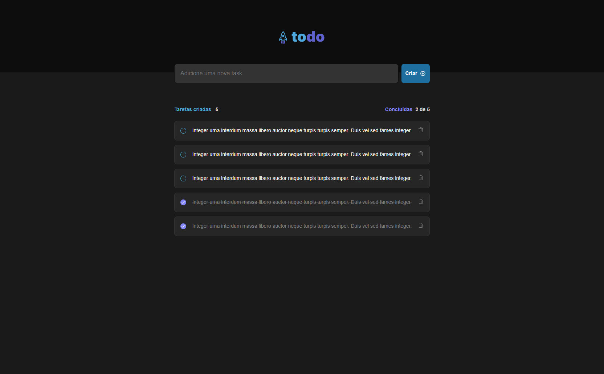

### Description:

The ig-todo challenge proposed by the Rocketseat institution is an initiative that aims to improve practical development skills. Focusing on building a to-do list application, the challenge covers the implementation of essential functionalities such as adding and removing tasks, marking completion.

Credits for the design goes to Millena Martins</a>

👉 Live Demo: <a href='https://ignite-todo-flame.vercel.app'>Ignite Todo</a>

### Screenshots of the Project 📸

  

